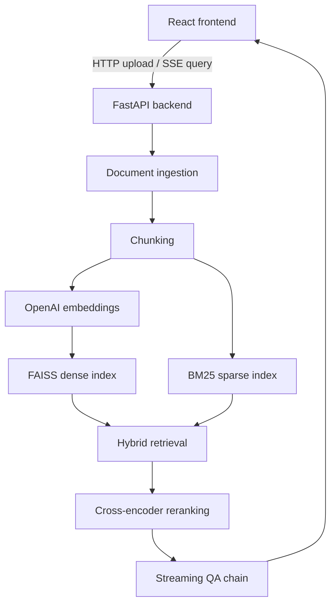

# DocLens

DocLens is a local Retrieval-Augmented Generation system for asking grounded questions over PDF, Markdown, and HTML documents.

## Architecture



## Features

- Upload and index PDF, Markdown, and HTML files.
- Ask natural-language questions with streamed answers.
- View source citations with expandable source text.
- Combine FAISS dense retrieval and BM25 sparse retrieval.
- Re-rank retrieved chunks with a local sentence-transformers cross-encoder.
- Keep lightweight in-memory conversation history for the current server session.
- Run locally with Docker Compose.

## Tech Stack

- Backend: Python, FastAPI, LangChain, FAISS, rank-bm25, sentence-transformers, OpenAI API.
- Frontend: React, Vite, CSS, Server-Sent Events over `fetch`.
- Evaluation: pytest and Pandas-based retrieval benchmark output.
- Infrastructure: Docker and Docker Compose.

## Quick Start

1. Copy the environment template:

   ```bash
   cp .env.example .env
   ```

2. Add your OpenAI API key to `.env`:

   ```bash
   OPENAI_API_KEY=your_key_here
   ```

3. Start the app:

   ```bash
   docker compose up --build
   ```

4. Open the frontend at [http://localhost:3000](http://localhost:3000).

The backend health check is available at [http://localhost:8000/health](http://localhost:8000/health).

## Manual Development

Backend:

```bash
cd backend
python -m venv venv
source venv/bin/activate
pip install -r requirements.txt
uvicorn app.main:app --reload
```

Frontend:

```bash
cd frontend
npm install
npm run dev
```

By default the Vite app calls `http://localhost:8000/api`. Override this with `VITE_API_BASE_URL` if needed.

## API

| Method | Endpoint | Description |
| --- | --- | --- |
| `GET` | `/health` | Health check |
| `POST` | `/api/upload` | Upload and index a PDF, Markdown, or HTML file |
| `GET` | `/api/query?q=...&conversation_id=...` | Stream a grounded answer and citations |
| `GET` | `/api/conversations` | List in-memory conversations |
| `GET` | `/api/conversations/{id}` | Get messages for one conversation |
| `DELETE` | `/api/conversations/{id}` | Delete one conversation |
| `GET` | `/api/documents` | List uploaded documents for the current server session |

## Configuration

| Variable | Default | Description |
| --- | --- | --- |
| `OPENAI_API_KEY` | empty | Required for embeddings and answer generation |
| `DATA_DIR` | `./data` | Local storage for uploads and indexes |
| `FRONTEND_ORIGIN` | `http://localhost:5173` | CORS origin for local frontend development |
| `CHUNK_SIZE` | `1000` | Text splitter chunk size |
| `CHUNK_OVERLAP` | `200` | Text splitter chunk overlap |
| `HYBRID_DENSE_WEIGHT` | `0.5` | FAISS retriever weight |
| `HYBRID_SPARSE_WEIGHT` | `0.5` | BM25 retriever weight |
| `RERANKER_MODEL_NAME` | `cross-encoder/ms-marco-MiniLM-L-6-v2` | Local reranking model |

## Testing

Run the backend test suite from the `backend` directory:

```bash
pytest
```

Run a production frontend build:

```bash
cd frontend
npm run build
```

## Evaluation

After uploading/indexing a representative document set, run:

```bash
cd backend
python -m evaluation.evaluate --dataset evaluation/eval_dataset.json --top-k 5
```

The script reports Top-K retrieval hit rate and writes timestamped JSON and CSV files to `backend/evaluation/results/`.

Current evaluation assets are a starter dataset and script. For the portfolio target, expand `eval_dataset.json` to 200+ Q&A pairs across the final corpus, then record the measured metrics here.

| Metric | Target | Current Status |
| --- | ---: | --- |
| Average response latency | `<3s` | Not benchmarked |
| Retrieval relevance Top-5 | `92%+` | Evaluation script ready |
| Hybrid + rerank answer lift | `18%+` | Needs full dataset |
| Supported formats | PDF, MD, HTML | Implemented |

## Project Structure

```text
DocLens/
├── backend/
│   ├── app/
│   │   ├── api/
│   │   ├── generation/
│   │   ├── ingestion/
│   │   └── retrieval/
│   ├── evaluation/
│   ├── tests/
│   ├── Dockerfile
│   └── requirements.txt
├── frontend/
│   ├── src/
│   ├── Dockerfile
│   └── nginx.conf
├── data/
├── docker-compose.yml
└── README.md
```

## Development Status

The project has passed the initial scaffold and core RAG implementation phases. The current focus is hardening: broader tests, a larger evaluation dataset, persistent conversation storage, and measured latency/quality results.

## Roadmap

- Replace in-memory history with SQLite or PostgreSQL persistence.
- Add a 200+ question evaluation dataset and publish benchmark results.
- Add source-preview routing for uploaded documents.
- Add CI for backend tests and frontend build.
- Add screenshots or a short demo GIF after final UI polish.
