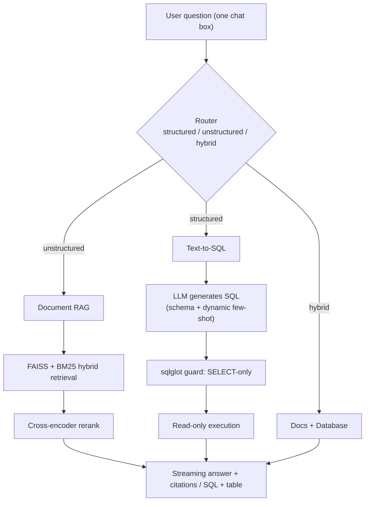

# DocLens

**DocLens is a hybrid "knowledge + data" assistant.** Ask a question in plain English and it
answers from either your **documents** (retrieval-augmented generation) or a **structured
database** (natural-language → SQL) — through a single streaming chat, with the retrieved
sources or the generated SQL always shown.

**Live demo:** https://doclens.eddyislearning.ai

## How it works

A lightweight router classifies each question and sends it down the right path:


```mermaid
flowchart TB
    Q["User question (one chat box)"] --> R{"Router<br/>structured / unstructured / hybrid"}

    R -->|unstructured| RAG["Document RAG"]
    R -->|hybrid| BOTH["Docs + Database"]
    R -->|structured| SQL["Text-to-SQL"]

    RAG --> HR["FAISS + BM25 hybrid retrieval"]
    HR --> RR["Cross-encoder rerank"]

    SQL --> G["LLM generates SQL<br/>(schema + dynamic few-shot)"]
    G --> GUARD["sqlglot guard: SELECT-only"]
    GUARD --> EX["Read-only execution"]

    RR --> ANS["Streaming answer + citations / SQL + table"]
    EX --> ANS
    BOTH --> ANS
```

- **Document RAG** — upload PDF / Markdown / HTML; chunks are embedded (OpenAI), indexed in
  **FAISS** (dense) + **BM25** (sparse), fused, and reranked by a local cross-encoder. Answers
  stream with expandable source citations and a relevance bar.
- **Text-to-SQL** — questions about the data are turned into a single read-only `SELECT` using the
  live schema plus **dynamically retrieved few-shot examples** from a schema knowledge base. The
  query is validated on its parse tree (`sqlglot`, SELECT-only), executed against a **read-only**
  connection with a row cap and timeout, then summarized — the generated SQL and result table are
  shown alongside the answer. One self-repair attempt on failure.
- **Router** — a cheap LLM call picks documents, database, or both, keeping everything behind one chat.

The sample database is **synthetic** demand-planning data (products, sales, inventory, forecasts,
suppliers, regions) — not real company data.

## Features

- One chat over unstructured documents **and** a structured database.
- Streaming answers with citations (RAG) or generated SQL + result table (Text-to-SQL).
- Read-only SQL safety: AST-validated SELECT-only, row cap, statement timeout, driver-level read-only.
- Schema-aware Text-to-SQL via a vector-indexed knowledge base (table docs, glossary, example queries).
- Multi-LLM evaluation harness with a reproducible leaderboard (see below).

## Tech stack

- **Backend:** Python, FastAPI (SSE streaming), LangChain, FAISS, rank-bm25, sentence-transformers,
  SQLAlchemy + SQLite, `sqlglot`, OpenAI API.
- **Frontend:** React, Vite, Server-Sent Events over `fetch`.
- **Evaluation:** OpenAI / Anthropic / Google via LangChain.
- **Infra:** systemd + nginx + Let's Encrypt (see `deploy/`), or Docker Compose for local.

## Quickstart

```bash
cp .env.example .env          # then add your OPENAI_API_KEY
```

**Docker (all-in-one):**
```bash
docker compose up --build     # frontend http://localhost:3000, backend http://localhost:8000
```

**Manual dev:**
```bash
# backend
cd backend && python -m venv venv && source venv/bin/activate
pip install -r requirements.txt
python -m app.database.seed   # build the synthetic DB (also auto-seeds on first boot)
uvicorn app.main:app --reload
# frontend (new shell)
cd frontend && npm install && npm run dev   # http://localhost:5173
```

Try: *"What is safety stock?"* (documents) · *"Which 3 products have the highest revenue?"* (database).

## API

| Method | Endpoint | Description |
| --- | --- | --- |
| `GET` | `/health` | Health check |
| `POST` | `/api/upload` | Upload + index a PDF / Markdown / HTML file |
| `GET` | `/api/query?q=&conversation_id=` | Unified streaming answer — routed to RAG / SQL / hybrid |
| `GET` | `/api/sql-query?q=` | Direct Text-to-SQL (JSON: answer + SQL + rows) |
| `GET` | `/api/documents` | Uploaded documents for the session |
| `GET` | `/api/conversations` · `/api/conversations/{id}` | Conversation history |

## Evaluation

A reproducible multi-LLM Text-to-SQL leaderboard (execution accuracy, valid-SQL rate, latency, cost):

```bash
cd backend && python -m evaluation.run_eval    # writes evaluation/results/
```

Findings and the latest numbers are in [`AI_NATIVE_BEST_PRACTICES.md`](AI_NATIVE_BEST_PRACTICES.md)
and `backend/evaluation/results/`. Every number there comes from an actual run — none are hand-written.

## Configuration

Set in `.env` (see `.env.example`):

| Variable | Default | Description |
| --- | --- | --- |
| `OPENAI_API_KEY` | — | **Required** — embeddings + generation |
| `ANTHROPIC_API_KEY` / `GOOGLE_API_KEY` | — | Optional — only for the multi-LLM eval |
| `EMBEDDING_MODEL` | `text-embedding-3-small` | Embedding model |
| `LLM_MODEL` | `gpt-4o-mini` | Generation / router / SQL model |
| `HYBRID_DENSE_WEIGHT` / `HYBRID_SPARSE_WEIGHT` | `0.5` / `0.5` | FAISS vs BM25 fusion weights |
| `CHUNK_SIZE` / `CHUNK_OVERLAP` | `1000` / `200` | Chunking |
| `RERANKER_MODEL_NAME` | `cross-encoder/ms-marco-MiniLM-L-6-v2` | Local reranker |
| `DATA_DIR` | `./data` | Runtime indexes + SQLite DB |

## Testing

```bash
cd backend && pytest          # unit + integration (integration auto-skips without a key)
```

## Deployment

See [`deploy/DEPLOY.md`](deploy/DEPLOY.md) — systemd-managed uvicorn behind nginx with Let's Encrypt TLS.
